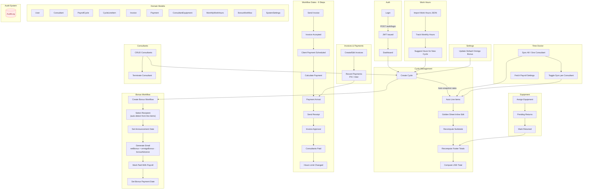

# VSol Admin

Local‑first, SQLite‑backed payroll management replacing the Excel "golden sheet" with real‑time calculations and audit logging.

## Start (PowerShell)

```powershell
cd C:\git
cd .\vsol-admin
pnpm install
pnpm db:migrate
pnpm db:seed
pnpm dev
```

- API: http://localhost:2020
- Web: http://localhost:5173

## Environment

- `apps/api/.env`
  - `PORT=2020`
  - `JWT_SECRET=change-me`
  - `DATABASE_URL=file:./dev.db`
  - `BACKUP_DIRECTORY` (optional) - Directory path for database backups. If not set, automatically detects OneDrive Documents folder (e.g., `C:\Users\<username>\OneDrive\Documents\backups`). Falls back to `backups/` in project directory if OneDrive is not found.
  - `CORS_ORIGIN` (optional) - Comma-separated list of allowed origins for CORS. Supports exact URLs and wildcard patterns (e.g., `https://abc123.ngrok.io` or `*.ngrok.io`). If not set, defaults to `http://localhost:5173` in development mode.
- `apps/web/.env`
  - `VITE_API_URL=http://localhost:2020/api` - Backend API base URL. For ngrok setup, set this to your API ngrok URL (e.g., `https://def456.ngrok.io/api`)

## Tech Stack

- Monorepo: Turborepo, pnpm workspaces
- Backend: Node.js, Express, Drizzle ORM (SQLite via libsql), Zod, helmet, cors, multer, date-fns, jsonwebtoken, bcryptjs
- Frontend: React 18, Vite 5, React Router v6, TanStack Query v5, TanStack Table v8, Shadcn/ui (Radix primitives), Tailwind CSS (+ tailwindcss-animate), react-day-picker, lucide-react, sonner
- Shared: TypeScript types + Zod schemas (`@vsol-admin/shared`)
- Tooling: TypeScript 5, tsx, Vitest (+ UI), Drizzle Kit, PostCSS, Autoprefixer

## Workflow (simplified)

1. Login with username/password → receive JWT
2. Create payroll cycle (month, global hours, bonuses)
   - Active consultants are fetched (no termination date)
   - Line items are auto‑created with a snapshot of `ratePerHour`
3. Edit line items inline on Golden Sheet
   - `workHours` default to cycle `globalWorkHours` if null
   - Subtotal per line: `(workHours × ratePerHour) + adjustmentValue − bonusAdvance`
4. Footer totals recompute in real time
   - `totalHourlyValue = SUM(ratePerHour across lines)`
   - `usdTotal = (totalHourlyValue × globalWorkHours) − (pagamentoPIX + pagamentoInter) + omnigoBonus + equipmentsUSD`
5. Invoices and payments tracked per cycle
6. All mutations are audit‑logged with user, entity, and change diff



## Formulas

- Line subtotal: `(workHours × ratePerHour) + adjustmentValue − bonusAdvance`
- Cycle USD total: `=B22*B26-(B23+B24)+B25+B27`
  - `B22 = totalHourlyValue`, `B26 = globalWorkHours`, `B23 = pagamentoPIX`, `B24 = pagamentoInter`, `B25 = omnigoBonus`, `B27 = equipmentsUSD`

## Login (dev)

- Users: `rommel`, `isabel`, `celiane`
- Password: `admin123`

## Changing User Passwords

To change a user's password, use the password change script:

```bash
# From the root directory
cd apps/api
pnpm user:change-password <username> <new-password>

# Example: Change rommel's password
pnpm user:change-password rommel myNewPassword123
```

Or run directly with tsx:

```bash
cd apps/api
pnpm tsx scripts/change-password.ts <username> <new-password>
```

The script will:
- Hash the new password using Argon2id
- Update the user's password in the database
- Display confirmation with user details

**Note**: Make sure the API server is not running when changing passwords, or ensure the database is not locked.

## ngrok Setup (Public Access)

**Current ngrok URLs**: See `NGROK_URLS.md` for active tunnel URLs and configuration.

To expose the application via ngrok public URLs:

1. Start ngrok tunnels:
   ```bash
   # Terminal 1: API tunnel
   ngrok http 2020
   # Copy the HTTPS URL (e.g., https://def456.ngrok.io)
   
   # Terminal 2: Web tunnel
   ngrok http 5173
   # Copy the HTTPS URL (e.g., https://abc123.ngrok.io)
   ```

2. Configure environment variables:
   - `apps/api/.env`: Add `CORS_ORIGIN=https://abc123.ngrok.io` (use your web ngrok URL)
   - `apps/web/.env`: Add `VITE_API_URL=https://def456.ngrok.io/api` (use your API ngrok URL)

3. Restart servers:
   - Restart API server to pick up `CORS_ORIGIN`
   - Restart web dev server to pick up `VITE_API_URL`

4. Access:
   - Frontend: Open your web ngrok URL in browser
   - API health check: `https://your-api-ngrok-url.ngrok.io/health`

**Note**: You can also use wildcard patterns like `*.ngrok.io` in `CORS_ORIGIN` for dynamic ngrok domains, or comma-separate multiple origins.

## Scripts

```bash
pnpm dev         # Run API (2020) and Web (5173)
pnpm build       # Build all packages
pnpm db:migrate  # Apply migrations
pnpm db:seed     # Seed dev data
pnpm db:studio   # Drizzle Studio
pnpm kill-all-ports  # Free 2020/5173 if needed (Windows PowerShell)
```

## Structure

```
vsol-admin/
├── apps/
│   ├── api/      # Express + Drizzle (SQLite)
│   └── web/      # React + Vite (SPA)
└── packages/
    └── shared/   # Types + Zod schemas
```
